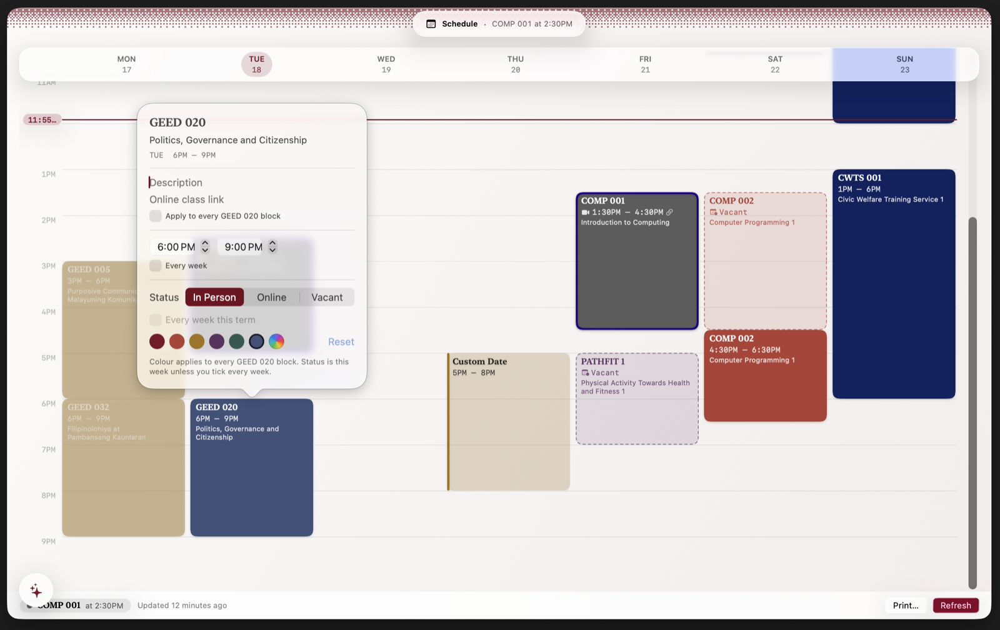
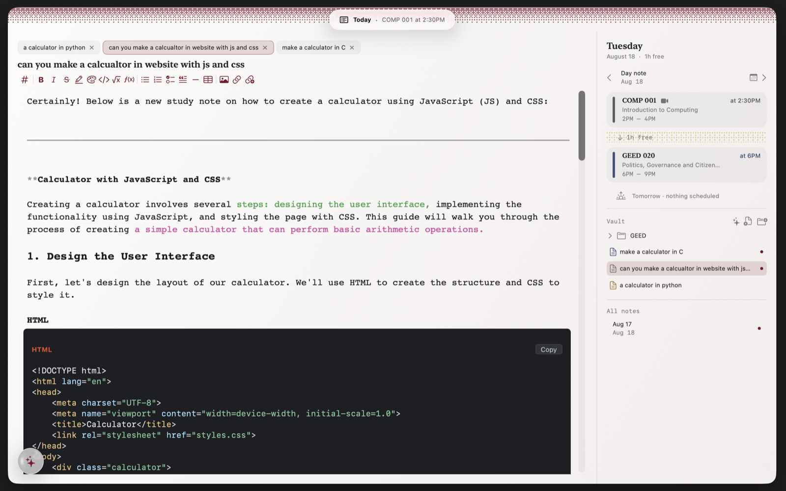
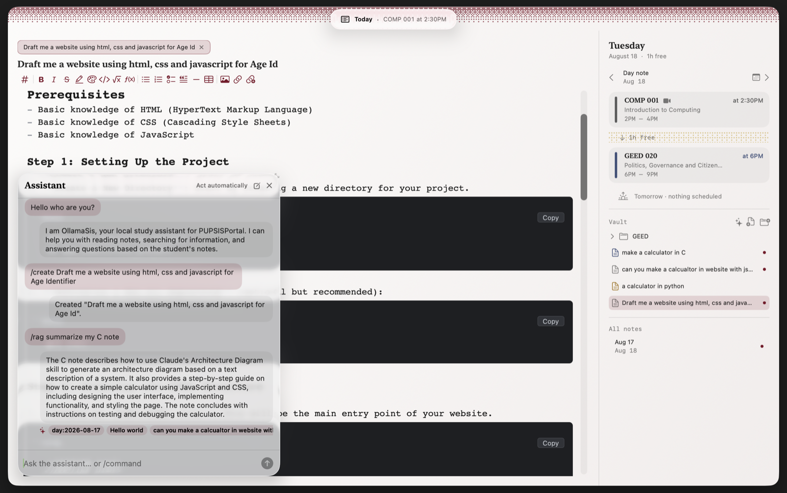
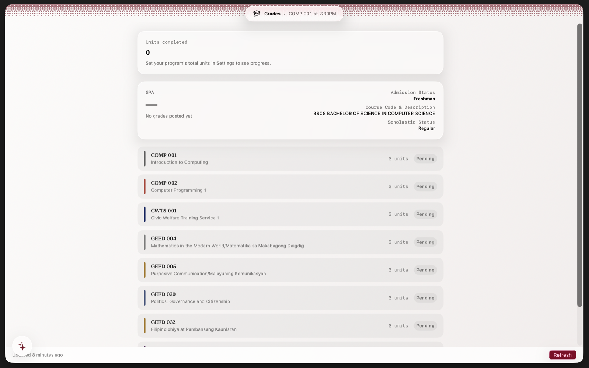
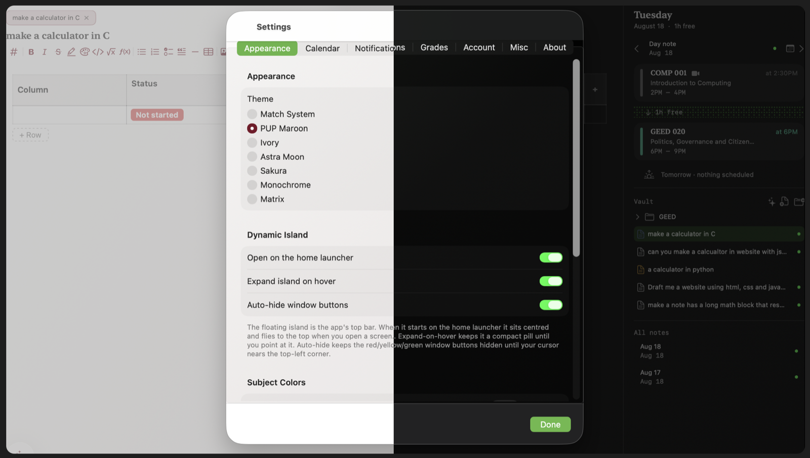
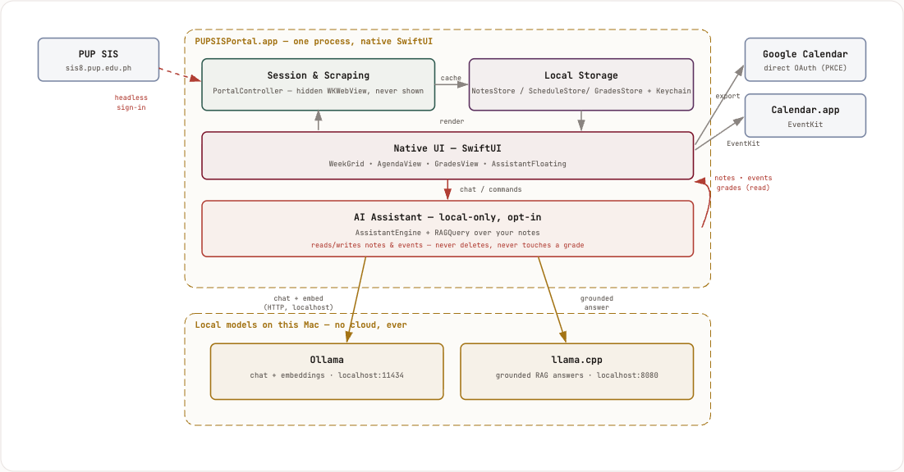

<div align="center">

# PUPSISPortal

**Your PUP class schedule, as a native Mac app.**
Signs into SIS headlessly — you never see the web portal, only your week.

[](#release-history)
[](#install)
[](LICENSE)
[](https://github.com/cGradying/IntPortal/releases)

</div>



<!-- Demo video: paste the github user-attachments URL here on its own line
     (see docs/media/README.md for how to get one). GitHub renders it as an
     inline player automatically. -->

Signs into the [PUP Student Information System](https://sis8.pup.edu.ph/student/)
**headlessly** and renders your own schedule and grades as a native SwiftUI
interface — the SIS web UI is never shown, only a hidden `WKWebView` holding
the session. Launches instantly from an offline cache, always knows what's
next, and exports cleanly to your real calendar.

Sibling to [PUPSIS](https://github.com/cGradying/PUPSIS) (which only auto-fills
the real site) — this one has its own interface.

Scope is strictly your own account and data — personal, non-commercial use,
which is what PUP's Terms of Use permit. It never scrapes other students,
bypasses auth, or redistributes SIS content.

---

## Quickstart

```sh
git clone https://github.com/cGradying/IntPortal.git
cd PUPSISPortal
Scripts/make_signing_identity.sh   # one-time: stable local signing identity
Scripts/make_mac_app.sh            # build + install to ~/Applications
```

Open it, enter your SIS student number and password — stored only in your
Keychain, never on disk. Prefer a prebuilt `.dmg` instead? See
[Install](#install) (unsigned; right-click → Open the first time).

---

## Contents

- [Quickstart](#quickstart)
- [Who it's for / use cases](#who-its-for--use-cases)
- [Install](#install)
- [First launch & sign-in](#first-launch--sign-in)
- [Using the app](#using-the-app)
  - [Navigating](#navigating)
  - [Schedule (week & year)](#schedule-week--year)
  - [Class status: online / vacant](#class-status-online--vacant)
  - [Today & Notes](#today--notes)
  - [AI Assistant (beta)](#ai-assistant-beta)
  - [Grades & GPA](#grades--gpa)
  - [Calendar sync & export](#calendar-sync--export)
  - [Reminders & menu bar](#reminders--menu-bar)
  - [Appearance](#appearance)
- [Setting up Google Calendar export](#setting-up-google-calendar-export)
- [Build from source](#build-from-source)
- [Architecture](#architecture)
- [Testing](#testing)
- [Security & privacy](#security--privacy)
- [Release history](#release-history)
- [Future plans](#future-plans)
- [License](#license)
- [Reviews](#reviews)

---

## Who it's for / use cases

For a PUP student who wants their SIS schedule and grades as a fast, native app
instead of a slow web portal.

- **Open once, glance daily.** Launches instantly from cache to your week grid
  and a "Today" agenda — no waiting on SIS, no re-logging-in.
- **Know what's next.** The now-line, "next class in N minutes", the menu-bar
  mini-agenda, and pre-class reminders keep you on time without opening a browser.
- **Put class on your real calendar.** Export your term into Apple Calendar,
  Google Calendar, or a shareable `.ics` file — repeating weekly, ending on your
  term-end date, and re-exporting cleanly replaces the old copy.
- **Track your standing.** Units-weighted GPA, a cross-term GPA trend, and
  units-completed progress, computed from your posted grades.
- **Adapt to reality.** Mark a meeting online or vacant (for one week or the
  whole term); the grid, exports, and reminders follow.
- **Keep notes with your day.** Attach notes to a class or the day, in plain text
  or Markdown.
- **Ask an AI that actually knows your notes.** A local, opt-in assistant that
  can search and summarize what you've written, add calendar events, and answer
  questions grounded in your own vault — never leaves your Mac.

---

## Install

Two ways in:

**A. Download a build** from [Releases](https://github.com/cGradying/IntPortal/releases):
grab the `.dmg`, drag `PUPSISPortal.app` to `~/Applications`, and open it. These
builds are **not notarized by Apple** (no paid developer account), so Gatekeeper
blocks a plain double-click. First open needs **right-click → Open → Open**, or
System Settings › Privacy & Security › "Open Anyway". This is expected for every
release, not a broken download — verify the download's checksum against the one
posted on the Release page if you want to confirm it wasn't tampered with in transit.

**B. Build it yourself** — see [Build from source](#build-from-source). This is
the recommended path and the one the signing notes below assume.

**Requirements:** macOS 14 or later. On macOS 26 the interface uses Liquid Glass;
on 14–15 those surfaces fall back to a plain material — it still runs, the glass
look just degrades.

---

## First launch & sign-in

1. Open the app. You'll see a sign-in screen (the real SIS site is never shown).
2. Enter your **PUP SIS student number and password**. They're stored only in the
   macOS Keychain and used to hold a session — never written to disk or logs.
3. The app signs in headlessly, scrapes your schedule, and draws the week grid.
   After the first time it launches straight to the cached calendar and refreshes
   in the background.

If a refresh fails (SIS down, no network), the cached calendar stays on screen
with a small "last updated" note instead of an error.

To change accounts: **Settings → Account → Edit Credentials** or **Sign Out**
(sign-out erases the cached schedule and grades).

---

## Using the app

### Navigating

A thin floating pill at the top center switches between **Schedule**, **Today**,
and **Grades** (or press **⌘1 / ⌘2 / ⌘3**). The **gear** (top-right) opens
**Settings** (**⌘,**). On the Schedule screen, the control cluster (week/year,
arrows, add) collapses into an icon — click it to expand.

### Schedule (week & year)

- **Week grid** with a live **now-line** carrying the current time; today's column
  is marked, past blocks dim.
- Switch to **Year** to see the whole term at a glance; click a week to jump to it.
- Move by week/year with the arrows or **⌘[** / **⌘]**; **Today** returns to now.
- **Add and edit your own events** right on the grid: drag to create, drag to
  move, drag an edge to resize, multi-select, duplicate, delete — all with undo.
  Repeating events ask "this event / all future" before changing a series.

### Class status: online / vacant

Right-click a class (or use its menu) to mark it **In person**, **Online**, or
**Vacant** — either **just this week** or for the **whole term**. Online meetings
get a colored strip; vacant ones drop out of the grid (toggle **Show Cancelled**
to bring them back faded). Status flows through to reminders and calendar exports.

### Today & Notes



The **Today** screen reads your day top to bottom: the class in session, what's
done, what's upcoming with a countdown, the **free time** between things, and a
one-line look at tomorrow. It folds in your own events from the calendars you've
ticked, so free-time reflects the whole day.

**Notes** attach right here, in a live Markdown editor (web-based CodeMirror,
bundled offline) that renders as you type — the Obsidian way, no Edit/Preview
toggle. Tap a class or event row to open its note, use the **day scratchpad**
for anything undated, or build a **vault** of folders and named notes in the
sidebar; open notes stack as **tabs** above the editor. A class note is **shared
across every week** the class meets (one note per subject), and its **Add dated
entry** button appends a `## <date>` heading — defaulting to the subject's **next
class meeting date**, or today — so it grows into a running dated log. Rows with a
note show a dot.

The editor supports:

- **Formatting** — headings, **bold** / *italic* / ~~strike~~ / ==highlight==,
  **colored text**, `> quotes`, bullet / numbered lists, and a **horizontal-rule
  divider**.
- **Interactive checkboxes** — `- [ ]` / `- [x]` render as real checkboxes you
  click to toggle.
- **Inline math** — `$…$` and `$$…$$` render live via KaTeX.
- **Code blocks** — fenced ```` ```lang ```` blocks get syntax highlighting, a
  language badge, and a copy button.
- **Note links** — `[[Title]]` renders as a clickable link that opens that note.
- **Images** — paste, drag-drop, or an `` URL; local images are
  copied into the app's storage and shown inline.
- **Tables / database** — insert an interactive table with typed columns
  (text, number, checkbox, date, and a **status** column with your own
  custom-colored tags). Click cells to edit, drag a column's edge to resize,
  add / remove rows and columns; the `×` controls appear on hover.

### AI Assistant (beta)



A floating orb (bottom-left, every screen) expands into a chat panel that can
read and add to your notes, read your schedule and grades, and add calendar
events — never delete, move, or change a grade. **Off by default**; turn it
on in **Settings → Misc → AI (beta)**, pick an installed
[Ollama](https://ollama.com) model, and set how much it acts on its own
(**Propose only** / **Confirm each action** / **Act automatically**).
Everything stays on your Mac, talking only to your local Ollama server — no
cloud provider, no way to point it elsewhere.

Type `/` in the chat for a filtered command palette:

- **`/read "Note"`** — pins a note into the conversation (no name = the note
  you have open).
- **`/summary "Note"`** — a one-shot AI summary.
- **`/create a prompt`** — writes a new note from a prompt.
- **`/rag "a question"`** — answers strictly from your notes vault, guaranteed
  to actually search them (asking the assistant directly can sometimes skip
  the search step — small local models aren't always reliable about deciding
  to call it; `/rag` bypasses that entirely).
- **`/help`** — lists commands.

**Retrieval (RAG).** The assistant ranks your notes by *meaning*, not just
keyword — pull `nomic-embed-text` (`ollama pull nomic-embed-text`) once and a
paraphrased question still finds the right note; without it, retrieval falls
back to keyword matching automatically. A second small local model
([llama.cpp](https://github.com/ggml-org/llama.cpp), started for you when
needed) reads the matched notes and writes one grounded answer, citing which
note(s) it drew from as a small chip under the reply. Right-click any note or
folder → **Include in AI search** to control what it's allowed to read
(everything's in by default; excluding a folder excludes everything inside
it); the Vault header's sparkles button shows how many notes are currently
searchable.

**In the editor:** select text for a popup offering Summarize, "Answer this",
"Structure this" (reorganizes into a clean technical reference, isolating and
language-tagging any code), or a custom prompt — results Replace, Insert
below, or Copy, with a soft glow reveal (Settings-picked: a connected sweep
down each line, or each word on its own). Right-click a note or folder for a
color label, or **Export** as Markdown, plain text, or a properly typeset PDF.

**Settings → Misc:** reveal the raw notes database in Finder, wipe every note
(confirmation-gated; login and everything else stay untouched), and tune the
retrieval pipeline (chunk size, match strictness, answer creativity, embedding
model) if the defaults ever need adjusting.

### Grades & GPA



The **Grades** screen shows your posted subjects, a **units-weighted GPA**, a
**cross-term GPA trend** (backfilled by driving the SIS School-Year/Semester
dropdowns), and **units completed**. Grade cells are empty until grades are
posted — that's the normal state most of a semester. Set your program's total
units in **Settings → Grades** for the completed-units progress.

### Calendar sync & export

**Settings → Calendar** (grant access once):

- **Show other calendars** — tick any calendar (Apple, iCloud, or a Google
  account you've added to macOS) to draw its events beside your classes.
- **Export classes** into a calendar you choose, as weekly repeats ending on your
  **Repeat until** date. Online classes can go to their own calendar. Exports are
  tagged, so **re-exporting replaces** the previous copy and leaves your own
  events alone. After the first export, status changes sync automatically.
- **Export `.ics`** — save a standard calendar file to import anywhere (Google
  web, a phone), no calendar access needed.
- For a reliable Google path, use [direct Google export](#setting-up-google-calendar-export)
  below.

### Reminders & menu bar

- **Settings → Notifications** — turn on a reminder a chosen number of minutes
  before each class. Vacant meetings are skipped.
- Reminders fire only while the app is running; enable **Start at login** so they
  fire even after a restart.
- The **menu-bar** item shows your next class and a today-at-a-glance mini-agenda,
  so you can close the window and still stay oriented.

### Appearance



**Settings → Appearance** — themes **PUP Maroon**, **Ivory**, **Astra Moon**, or
**Match System**, plus per-subject color overrides.

---

## Setting up Google Calendar export

The most reliable way to get classes into Google (macOS's built-in Google/CalDAV
sync often refuses repeating events). This writes to Google directly over its API
using **your own** OAuth client — no secrets are shipped, and only your account
is touched.

One-time setup at [Google Cloud Console](https://console.cloud.google.com):

1. Create a **project**.
2. **APIs & Services → Enable APIs** → enable **Google Calendar API**.
3. **OAuth consent screen** → External → add your own Google account as a
   **Test user**.
4. **Credentials → Create credentials → OAuth client ID** → application type
   **iOS**, bundle ID `com.cgradying.pupsisportal`. Copy the **Client ID**
   (ends in `.apps.googleusercontent.com`).
5. In PUPSISPortal: **Settings → Google Calendar (direct)** → paste the Client ID
   → **Connect Google** → approve in the browser → pick a calendar → **Export to
   Google**.

Re-exporting replaces only the events this app wrote. **Note:** while your consent
screen stays in "testing", Google expires the sign-in about **once a week**, so
you'll tap **Connect** again occasionally — that's Google's rule for unpublished
apps, not a bug.
---

## Build from source

Same commands as [Quickstart](#quickstart). Pure SwiftPM — no Xcode project
needed, just a Swift toolchain (Xcode 16+ on macOS 14–15; Xcode 26+ to get the
Liquid Glass look on macOS 26). `swift test` runs the parser/store/logic suite
separately if you want it.

`make_mac_app.sh` builds the release binary, assembles `PUPSISPortal.app`
(bundle id `com.cgradying.pupsisportal`) with a generated `Info.plist` and icon,
code-signs it, and installs to `~/Applications` (pass a directory to install
elsewhere).

### Signing note

`make_signing_identity.sh` creates a stable **self-signed** code-signing identity
in the login keychain. Without it, `make_mac_app.sh` falls back to ad-hoc signing,
whose code identity changes every build — which invalidates the Keychain ACL for
your saved credentials and makes the first post-build launch block on a
`SecurityAgent` prompt before drawing a window. Run it once, and click **Always
Allow** on the first launch after a build.

---

## Architecture

Pure SwiftPM, one executable target (`Sources/PUPSISPortalApp`) plus a test
target. Single-window SwiftUI app; no view-model layer.



### Session & data (`Core/`)

| File | Role |
|---|---|
| `PortalController.swift` | Owns the single hidden `WKWebView`. Headless sign-in, navigation-settling, schedule/grades loading. `@MainActor`, `WKNavigationDelegate`. |
| `SISScraper.swift` | The scraping JavaScript. A shared table walker maps header cells to output keys by name (positional fallback); Schedule and Grades share it. |
| `ScheduleParser.swift` / `GradesParser.swift` | Scraped rows → `[ClassSession]` / `[SubjectGrade]` + `GradeReport` (units-weighted GPA, term identity). |
| `Models.swift` / `Credentials.swift` | `Weekday`, `ClassSession`; the student-number/password/birthdate struct handed to sign-in. |
| `Markdown.swift` | Minimal Obsidian-flavored block parser (headings, bullets, task checkboxes) for notes; inline emphasis is left to `AttributedString(markdown:)`. |
| `DayAgenda.swift` / `NextClass.swift` | Pure "today right now" and "what's next" readings, shared by the Today screen and the menu bar. |
| `KeychainStore.swift` / `GoogleTokenStore.swift` | SIS credentials and the Google refresh token in the Keychain (service `ph.edu.pup.sis8.portal`). |
| `ScheduleStore.swift` / `GradesStore.swift` / `NotesStore.swift` | Offline JSON documents under Application Support (dir `0700`, file `0600`). `NotesStore` also owns the vault tree (folders/notes, color labels, per-note RAG inclusion) and `wipeAll()`. |
| `NoteExport.swift` / `NoteImages.swift` | A note's Markdown → plain text or a typeset PDF; pasted-image storage and orphan cleanup. |
| `OllamaClient.swift` / `LlamaCppClient.swift` / `LlamaServerManager.swift` | The two local model connections behind the AI assistant — Ollama (chat, embeddings) and llama.cpp (grounded RAG answers, process managed on demand) — plus the shared HTTP client shape both reuse. |
| `Preferences.swift` | Theme, per-subject colors, per-week/term `SessionStatus`, calendar/export settings, notes style, notification prefs, AI/RAG tuning (Settings → Misc). `UserDefaults`, injectable for tests. |
| `Theme.swift` | `Palette` (injected via `\.palette`), `ThemeChoice`, the `Motion` vocabulary, `Theme.Typo` type scale. |
| `CalendarBridge.swift` / `EventEditor.swift` | The single `EKEventStore`: reads the week, writes/exports events; every mutation routes through `EventEditor` for one undo hook. |
| `ICSExporter.swift` / `ClassRecurrence.swift` | `.ics` file export and the shared weekly-`RRULE` builder. |
| `GoogleAuth.swift` / `GoogleCalendarClient.swift` | PKCE OAuth (no secret) and the Calendar REST client for direct Google export. |
| `Notifier.swift` / `LoginItem.swift` | Weekly reminder triggers, and `SMAppService` start-at-login so they survive a quit. |
| `GridGeometry.swift` / `TimeSnap.swift` / `DayBlock.swift` / `MonthLayout.swift` | Point↔(day,minute) math, snapping, the flat render model, and the year grid. |

### AI Assistant (`Core/Assistant/`)

| File | Role |
|---|---|
| `AssistantEngine.swift` | Talks to Ollama's structured-JSON `/api/chat` (not native tool-calling — small models follow a JSON schema far more reliably); Propose/Confirm/Auto permission loop. |
| `AssistantTool.swift` | The tool catalog — single source of truth for the system prompt and the response schema, so they can't disagree about what exists. |
| `RealAssistantExecutor.swift` | Runs a tool call against the real stores — the only place model output touches app state. |
| `AssistantCommand.swift` / `AssistantCommandRunner.swift` | Slash commands (`/read`, `/summary`, `/create`, `/rag`, `/help`) — parsed and run deterministically, never through the model's own tool-picking. |
| `RAGQuery.swift` / `NoteRetrieval.swift` | The retrieval pipeline shared by the `ask_notes`/`search_notes` tools and `/rag`: embeddings via Ollama (`nomic-embed-text`) ranked by cosine similarity, falling back to TF·IDF term matching when no embedding model is installed; paragraph-chunked so one long note doesn't dilute or blow past the answer budget. |
| `AssistantContext.swift` / `AssistantSession.swift` / `AssistantInstructions.swift` | What the model is told each turn (open note, today's classes, grades); the panel's live conversation state; the user's own editable house-style instructions. |

### Views (`Views/`)

Weekly grid (`WeekGrid`, `Blocks`, `GridInteractionLayer`), the now-line
(`NowLine`), year view (`YearView`), the top-center nav pill (`DestinationBar`),
the Today agenda + notes (`AgendaView`, `WebNoteEditor` — a `WKWebView` hosting
the bundled CodeMirror editor in `Resources/notes-editor.bundle.js`, built from
`notes-editor/`, including its own selection-based AI popup and the AI-insert
reveal animation), the floating assistant (`AssistantFloating` — orb ↔ chat
panel, command autocomplete), Grades + GPA trend (`GradesView`), Settings
(`SettingsView`, including the AI/RAG tuning and notes-wipe controls on
Misc), the menu bar (`MenuBarPanel`), event editing (`EventEditorPopover`, `SelectionBar`,
`ColorPanel` for per-block recoloring), sign-in (`CredentialsView`), and
`GlassCompat` — every Liquid Glass call in the app routes through it, so glass
degrades to a plain material below macOS 26 instead of failing to build.

---

## Testing

```sh
swift test
```

Parsing, stores, GPA/history, day-agenda, Markdown, `.ics`, and the Google event
builder are unit-tested with real scraped-*shape* fixtures — never real personal
data. UI and live SIS / EventKit / Google integration are verified by running the
packaged app.

---

## Security & privacy

- Credentials live **only** in the macOS Keychain
  (`security find-generic-password -s ph.edu.pup.sis8.portal`) — never on disk,
  in logs, or in commits. The Google **refresh token** is in the Keychain too; the
  client ID is not a secret.
- Cached schedule/grades/notes are your own data: Application Support, file mode
  `0600`, erased on sign-out.
- Nothing is sent anywhere but the real PUP SIS server and — only if you set it up
  — your own Google Calendar. Only your own pages are read: no other students'
  data, no auth bypass.

---

## Release history

Builds are self-signed/unsigned (see [Install](#install)); `CFBundleShortVersionString`
is `1.1.2` in `Scripts/make_mac_app.sh`. Grouped by what actually shipped, oldest first:

| Version | Date | Shipped |
|---|---|---|
| v0.1 | 2026-08-05 | Native rewrite of the headless sign-in (DOM-poll detection, not URL matching); first native weekly calendar; offline schedule cache; macOS 26 redesign with themes, the now-line, and per-class editing; dated week grid, year view, Calendar.app sync. |
| v0.2 | 2026-08-06 | Full event editing on the grid — drag to create/move/resize, multi-day blocks, multi-select, undo; pre-class reminders and "what's next"; Grades page with a computed units-weighted GPA. |
| v0.3 | 2026-08-07 | Menu-bar presence; per-week and whole-term class status (online/vacant) with colored strips; status-aware calendar export — auto-sync on status change, online classes to their own calendar, vacant classes hidden. |
| v0.4 | 2026-08-08 | Today agenda, cross-term GPA trend, menu-bar mini-agenda, Ivory theme, start-at-login; dynamic-island nav pill replacing the sidebar; macOS 14+ compatibility (glass gated to macOS 26, plain material below it); direct Google Calendar OAuth export; `.ics` export; custom events + free time in Today; popup Markdown notes. |
| v1.0 | 2026-08-08 | Full README documentation pass — use cases, walkthrough, setup, architecture. |
| v1.1 | 2026-08-12 | Notes reworked into a live web-based editor (CodeMirror + KaTeX): a folder/file vault with note tabs; shared-per-subject class notes with dated log entries (next-class-aware); colored text, checkboxes, dividers, `[[note links]]`, inline image preview (paste/drop/URL), and an interactive typed-column table/database with custom-colored status tags and drag-to-resize columns. First GitHub Release, `.dmg` attached. |
| v1.1.1 | 2026-08-13 | Window chrome rework — nav island, dither band; switched licensing to PolyForm Noncommercial 1.0.0. |
| v1.1.2 | 2026-08-14 | Fixed drag-to-create-event dragging the whole window instead of drawing an event (the chrome now has its own explicit drag strip). |
| v1.2.0 | 2026-08-17 | **AI Assistant, beta**, built up over several stages: a floating chat (orb → panel, Propose/Confirm/Auto permission) that reads/adds notes, reads schedule and grades, and adds calendar events — never deletes, moves, or changes a grade. Slash commands (`/read`, `/summary`, `/create`, `/rag`, `/help`) bypass the model's own tool-picking entirely, with a keyboard-navigable autocomplete palette. Real retrieval over the notes vault — embeddings (`nomic-embed-text`) ranked by cosine similarity with a keyword-matching fallback, paragraph-chunked so one long note can't blow past the answer budget or get silently dropped like it originally did — and a local llama.cpp model writes one grounded answer citing which notes it drew from. Per-note/folder "Include in AI search" toggle and color labels; note export as Markdown/plain text/typeset PDF. In the editor: a selection popup (Summarize / Answer this / Structure this / custom prompt → Replace / Insert below / Copy) and a Siri-style word-by-word reveal for AI-inserted text (Sweep or Word blink, Reduce-Motion aware), fixed to track scrolling correctly and to never stop partway through a long insert. New Settings → Misc tab: reveal the notes database in Finder, wipe all notes, and tune the retrieval pipeline (chunk size, match strictness, context budget, answer creativity, embedding model). Also this cycle: memory check before loading a model plus clean AI shutdown on quit, a user-editable house-style instructions file, per-class time overrides (this week / every week) and a per-class description + join link on the calendar, and printing/exporting the week as a PDF. |
| **v1.2.1** | 2026-08-17 | UI polish pass: fixed a visible seam under the Today screen's top bar and pane divider (two panes were each repainting the background wash on their own bounds instead of sharing the window's one gradient), and the dither band no longer clips raggedly past the window's rounded corner. Dither promoted to a reusable `DitherFill` primitive used where it signals state — finished agenda rows read as pixel-eroded, free-time gaps and the empty-day state carry a faint texture — instead of being one decorative strip. The assistant panel is now resizable (drag the corner grip, size persists) and its orb↔panel transition is a real morph; replies render Markdown and are selectable, source chips scroll instead of overflowing, there's a clear-conversation button, and the "thinking" spinner is a pixel-blink indicator. Added motion to the previously-static Today sidebar (selection, folder expand, tab open) — all Reduce-Motion compliant. README architecture diagram recolored to the app's own PUP Maroon palette on white paper and trimmed to essentials. Current. |

---

## Future plans

- **Signed, notarized releases.** Current `.dmg`/`.app` builds are self-signed
  or ad-hoc (see [Install](#install)) — Gatekeeper will always flag them until
  there's an Apple Developer ID to notarize against. Until then, treat every
  release the same way: right-click open, and check the posted checksum if
  you want to confirm the download.
- **Grades/GPA verified against a live posted-grades page.** The parser and
  the per-term GPA-trend backfill (driving the SIS SY/Semester dropdowns) are
  built and unit-tested against fixture shapes, but not yet confirmed against
  a real account with posted grades — benched until that's possible.
- **Parked, not forgotten:** a real WidgetKit next-class widget needs an
  Xcode project and a paid Apple Developer account (App Group for app↔widget
  data) — this app is intentionally SwiftPM + shell-packaged. The menu bar
  stands in as the glanceable surface instead.
- **Windows port, paused.** A C#/.NET + WinUI 3 build lives in this repo under
  [`windows/`](windows/README.md), sharing this app's ported logic and the same
  SIS quirks. The portable core is tested (200 tests), the WinUI app compiles
  on a real Windows runner in CI, and it has been built and launched on a
  Windows machine. It's **on hold pending an interface rework** — the
  underlying pipeline works, the UI isn't good enough to ship. No release date;
  macOS is the supported platform today. See that README for detail.
- **Out of scope by design:** multiple accounts, or any other student's data.
  Scope stays one person's own account, personal and non-commercial, per
  PUP's Terms of Use — see [License](#license).

---

## License

[PolyForm Noncommercial 1.0.0](LICENSE) — free for personal, non-commercial
use (which is the only use PUP's Terms of Use permit anyway); no commercial
use or redistribution as part of a commercial offering.

---

## Reviews

_Feedback from people using the app will go here._

> \_"**08/17/26 — Bug report: Topbar buttons disappear on hover (Full Screen)**
> **Steps to reproduce:**
>
> > 1. Launch the app on macOS Sequoia 15.6.1.
> > 2. Enter full-screen mode.
> > 3. Hover the mouse over the topbar.
> >    **Expected:** Topbar buttons remain visible on hover.
> >    **Actual:** Topbar buttons disappear when hovered while in full-screen.
> >    **Notes:** Bug occurs only in full-screen; not reproducible when the app is windowed.
> >    _Reporter: Mark (macOS Sequoia 15.6.1)_"\_

---

<div align="center">

[](https://github.com/cGradying)

</div>
